# Ultraconic White‑Label Gaming Platform — Technical Documentation

> A multi‑tenant, white‑label online gaming (casino / sports / slots / lottery) platform.
> One central **control plane** (Super Admin) provisions and brands many isolated
> **products** (e.g. Dollara, Product B, Product C). Each product ships a Django API,
> a Next.js web app (with swappable themes), and a React Native mobile app — all driven
> from the same shared database‑per‑tenant architecture.

This README is the canonical engineering reference for the whole monorepo. It is written
for a senior engineer onboarding cold: it explains *what* each part is, *why* it exists,
and *how* the parts interact. Where the code and the prose could drift, the code wins —
this document is derived from the code as it exists in the repository.

---

## Table of Contents

1. [Executive Summary](#1-executive-summary)
2. [Repository Layout](#2-repository-layout)
3. [Technology Stack](#3-technology-stack)
4. [High‑Level Architecture](#4-high-level-architecture)
5. [Multi‑Tenancy: Database‑per‑Tenant](#5-multi-tenancy-database-per-tenant)
6. [Tenant Resolution & Request Flow](#6-tenant-resolution--request-flow)
7. [Authentication & Authorization](#7-authentication--authorization)
8. [Branding & Theme System](#8-branding--theme-system)
9. [The Gaming Module (Aggregator Integration)](#9-the-gaming-module-aggregator-integration)
10. [Component: `super_admin/api` (Control Plane API)](#10-component-super_adminapi-control-plane-api)
11. [Component: `super_admin/web` (Control Plane Console)](#11-component-super_adminweb-control-plane-console)
12. [Component: `dollara/api` (Product Backend)](#12-component-dollaraapi-product-backend)
13. [Component: `dollara/web` (Product Web App)](#13-component-dollaraweb-product-web-app)
14. [Component: `dollara/mobile` (Product Mobile App)](#14-component-dollaramobile-product-mobile-app)
15. [Database Schema Reference](#15-database-schema-reference)
16. [API Reference](#16-api-reference)
17. [Startup & Execution Flow](#17-startup--execution-flow)
18. [Business Logic & Rules](#18-business-logic--rules)
19. [Configuration Reference](#19-configuration-reference)
20. [Build, Run & Deploy](#20-build-run--deploy)
21. [Testing](#21-testing)
22. [Security Review](#22-security-review)
23. [Performance Review](#23-performance-review)
24. [Code Quality & Technical Debt](#24-code-quality--technical-debt)
25. [Glossary](#25-glossary)
26. [Appendix: File‑by‑File Index](#26-appendix-file-by-file-index)

---

## 1. Executive Summary

The platform is a **B2B SaaS gaming framework**. A platform operator runs a single
**Super Admin** control plane. Through it they onboard *products* (white‑label brands).
Each product is a fully isolated tenant with:

- its **own MySQL database** (users, wallets, games, transactions, …);
- its **own branding** (name, logo, colors, support contacts) authored centrally;
- a **live theme** (complete UI/UX skin) selected centrally;
- a **product API** (`dollara/api`) that serves only that tenant's data;
- a **web** front end (`dollara/web`) and **mobile** app (`dollara/mobile`).

`dollara/` is the reference product implementation. To launch "Product B", you provision
a new tenant from Super Admin and deploy copies of the same `dollara/*` codebases pointed
at the new tenant slug — no code fork is required for branding or theming.

The headline technical features:

| Capability | Where it lives | Notes |
|---|---|---|
| Database‑per‑tenant isolation | `dollara/api/tenants/`, `middleware/` | Dynamic connection registration + DB router |
| Central provisioning | `super_admin/api/services/tenant_provisioning.py` | Creates DB + applies `init.sql` |
| White‑label branding | master `branding` table + public endpoint | Served to web/mobile at runtime |
| Per‑product theme switching | master `product_themes` table + `dollara/web/src/themes/` | A theme is a whole UI, not a color swap |
| External game aggregator | `dollara/api/services/game_provider.py` + `core/game_services.py` | AES‑256 launch + idempotent callback settlement |
| In‑process AI | `dollara/api/core/ai/` | PyTorch fraud scoring, welcome‑call & chat scripts |
| Real‑time live ticker | `dollara/api/core/consumers.py` (Channels/WS) | `/ws` feed |
| GraphQL + REST | `dollara/api/core/graphql_schema.py`, `core/urls.py` | Strawberry GraphQL alongside DRF‑style views |

---

## 2. Repository Layout

```
shamb_01/                         ← git root
├── README.md                     ← (this file)
├── .gitignore
│
├── super_admin/                  ← CONTROL PLANE (one per platform)
│   ├── api/                      ← Django control-plane API (port 8000)
│   │   ├── config/               ← settings, urls, wsgi, health view
│   │   ├── core/                 ← per-tenant model mirror + seed_master command
│   │   ├── middleware/           ← db_router (control-plane → master DB)
│   │   ├── services/             ← branding, tenant_provisioning, tenant_resolver
│   │   ├── tenants/              ← master models, views, themes catalog, auth, urls
│   │   └── database/master.sql   ← master/control-plane schema
│   └── web/                      ← Next.js console (port 3001)
│       └── src/app/              ← login, overview, products (CRUD + branding + themes)
│
└── dollara/                      ← REFERENCE PRODUCT (one tenant)
    ├── api/                      ← Django product API (port 5000)
    │   ├── config/               ← settings, test_settings, urls, asgi, wsgi
    │   ├── core/                 ← all per-tenant features (auth, wallet, games, admin, ai)
    │   │   ├── ai/               ← PyTorch fraud + welcome-call + chat
    │   │   └── tests/            ← gaming-module unit/integration tests
    │   ├── middleware/           ← TenantResolverMiddleware + TenantRouter
    │   ├── services/             ← branding, tenant_resolver, game_provider
    │   ├── tenants/              ← read-only master-DB model mirror + state
    │   └── database/init.sql     ← per-tenant schema + 263-game seed catalog
    ├── web/                      ← Next.js player web app (port 3000)
    │   └── src/
    │       ├── app/              ← App-Router routes (player + /admin console)
    │       ├── themes/           ← theme1 + theme2 (each: shell + full page set)
    │       ├── components/       ← shared + admin component library
    │       ├── hooks/            ← branding, theme, game catalog/play, guest-only
    │       ├── services/         ← api, adminApi, graphql, tenant
    │       ├── store/            ← zustand auth + light/dark theme
    │       └── middleware.js     ← tenant cookie/header injection
    ├── mobile/                   ← React Native app (Android + iOS)
    │   └── src/                  ← screens, navigation, store, services, branding
    ├── games.md / gamesv1.md     ← legacy PHP aggregator analysis (source for the rebuild)
    └── research.md               ← sample aggregator launch response
```

> **Important:** `super_admin` and `dollara` are siblings. The product API only *reads*
> the master DB; it never exposes Super Admin endpoints. Conversely the Super Admin API
> only writes the master DB and provisions/inspects tenant DBs.

---

## 3. Technology Stack

### Backend (`super_admin/api`, `dollara/api`)

| Technology | Version (req.) | Why it's here |
|---|---|---|
| **Python / Django** | 5.1.x | Core web framework for both APIs |
| **Django REST framework** | 3.15 | JSON rendering; views are function‑based, hand‑rolled |
| **Strawberry GraphQL** | 0.252+ | `/graphql` query API consumed by web/mobile (`me`, `wallet`, `games`, dashboard, live tickers) — *product API only* |
| **Django Channels + Daphne** | 4.x | ASGI server + WebSocket `/ws` live ticker — *product API only* |
| **MySQL** (mysqlclient) | 8 / 2.2 | Master DB + one DB per tenant |
| **PyJWT** | 2.9 | HS256 JWT auth tokens |
| **bcrypt** | 4.2 | Password & OTP hashing |
| **cryptography** | 43+ | AES‑256‑ECB for aggregator payloads — *product API only* |
| **requests** | 2.32 | Outbound aggregator HTTP — *product API only* |
| **PyTorch + NumPy** | 2.5 / 2.0 | In‑process fraud‑scoring MLP — *product API only* |
| **django-cors-headers** | 4.6 | CORS for the SPA front ends |
| **python-dotenv** | 1.0 | `.env` loading |
| **gunicorn** | 23 | WSGI production server (HTTP path) |

### Frontend — Web (`super_admin/web`, `dollara/web`)

| Technology | Version | Why |
|---|---|---|
| **Next.js (App Router)** | 14.2.18 | React framework; SSR shell + client components |
| **React** | 18.3 | UI library |
| **Zustand** | 5 | Lightweight global state (auth, theme) — *dollara/web* |
| **Tailwind CSS** | 3.4 | Utility‑first styling (config differs per app) |
| **lucide-react** | 0.469 | Icon set |
| **sweetalert2** | 11 | Toasts / confirm dialogs in admin & console |
| **graphql / graphql-request** | 16 / 7 | (declared) GraphQL client deps — *dollara/web* |

### Frontend — Mobile (`dollara/mobile`)

| Technology | Version | Why |
|---|---|---|
| **React Native** | 0.85.3 | Cross‑platform native app |
| **React** | 19.2.3 | (Note: newer than the web's React 18) |
| **@react-navigation** (native‑stack + bottom‑tabs) | 7.x | Navigation |
| **Zustand** | 5 | Auth + wallet stores |
| **@react-native-async-storage** | 3 | Token + wallet persistence |
| **react-native-vector-icons** | 10 | Icons |
| **react-native-gesture-handler / safe-area-context / screens** | — | RN infra |

### Integrations / external services referenced

- **External game aggregator** (iframe‑served games; AES‑secured launch + callbacks).
- **AWS S3** (env keys present for asset hosting; not wired in code shown).
- **Twilio / WhatsApp / MSG91** (OTP delivery env keys present; OTP is currently logged, not sent).

---

## 4. High‑Level Architecture

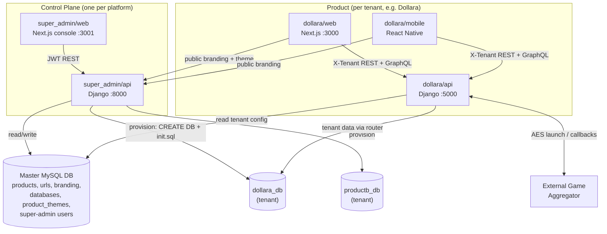

### Architectural layers (per request)

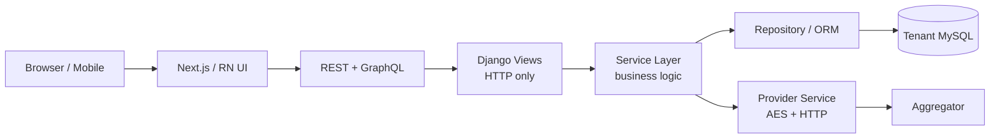

The product API follows a deliberate **clean‑architecture split** (most rigorous in the
gaming module): controllers (`views.py`) only parse/authorize/map errors; services hold
business logic; repositories own data access; the provider service is the only code that
speaks the aggregator's wire protocol.

---

## 5. Multi‑Tenancy: Database‑per‑Tenant

This is the backbone of the platform. There is **one master/control‑plane database** and
**one isolated database per product**.

- The Django `default` connection always points at the **master** DB
  (`dollara/api/config/settings.py`, `super_admin/api/config/settings.py`).
- Each tenant DB is exposed to Django as a **dynamically registered** connection alias
  `tenant_<slug>` (slug dashes → underscores). See
  [`tenants/state.py#register_tenant_connection`](dollara/api/tenants/state.py).
- A **database router** (`middleware/db_router.py`) sends the control‑plane app
  (`tenants`) to `default`, and every other app (`core` features) to the *currently
  resolved* tenant connection.

```mermaid
graph TD
  REQ[Incoming request] --> MW[TenantResolverMiddleware]
  MW -->|set thread-local<br/>db_alias = tenant_dollara| TL[(thread-local state)]
  ORM[core ORM query] --> RT{TenantRouter._db_for}
  RT -->|app_label == tenants| DEF[default = master]
  RT -->|else| CUR[get_current_db&#40;&#41; → tenant_dollara]
  TL -.read.-> CUR
```

Key files:

- [`dollara/api/tenants/state.py`](dollara/api/tenants/state.py) — thread‑local current
  tenant, `register_tenant_connection()`, `use_tenant()` context manager, and
  `tenant_atomic()` (an `atomic()` bound to the resolved connection so money movements
  commit on the right DB).
- [`dollara/api/middleware/db_router.py`](dollara/api/middleware/db_router.py) —
  `TenantRouter`. `CONTROL_PLANE_APPS = {'tenants'}` always go to `default`;
  `allow_migrate` blocks feature schema from ever landing on master.
- [`dollara/api/middleware/tenant.py`](dollara/api/middleware/tenant.py) —
  `TenantResolverMiddleware`. Resolves the tenant at the start of every request and
  **always clears the thread‑local in a `finally`** so connections never leak across the
  worker thread pool.

> **Why thread‑local, not request attribute?** The router (`db_for_read/write`) has no
> access to the request object — only the model. A thread‑local lets the router read the
> active tenant for the in‑flight request without threading it through every call.

The **master DB schema** is disjoint between the two backends' ORMs:

- `super_admin/api/tenants/models.py` defines the **writable** master models
  (`Product`, `ProductTheme`, `Branding`, `Url`, `Database`, `User`, `UserSession`).
- `dollara/api/tenants/models.py` is a **read‑only mirror** of the subset Dollara needs
  (`Product`, `ProductTheme`, `Branding`, `Url`, `Database`) — it reads tenant config &
  branding but never writes the control plane.

Django migrations are **disabled** for both apps (`MIGRATION_MODULES = {'core': None,
'tenants': None}`); all schema is applied via raw SQL (`master.sql` / `init.sql`).

---

## 6. Tenant Resolution & Request Flow

A request's tenant is resolved in **priority order** by
[`services/tenant_resolver.py#resolve_tenant`](dollara/api/services/tenant_resolver.py):

1. **`X-Tenant` / `X-Tenant-ID` header** (or `?tenant=` query) — used by the mobile app
   and server‑to‑server calls.
2. **Host / subdomain** — `dollara.com` → `dollara`; reserved labels `www/api/admin` are
   ignored; local hosts (`localhost`, `127.0.0.1`) yield no slug.
3. **JWT `tenant` claim** — embedded at sign time so native clients without a host header
   still resolve correctly.
4. **`DEFAULT_TENANT`** (default `dollara`) — development fallback for `localhost`.

Once a `Product` is found, the resolver looks up its row in the master `databases` table
and registers the tenant connection; if no row exists it falls back to `MYSQL_*` env
(single‑tenant/dev). It then sets the thread‑local context.

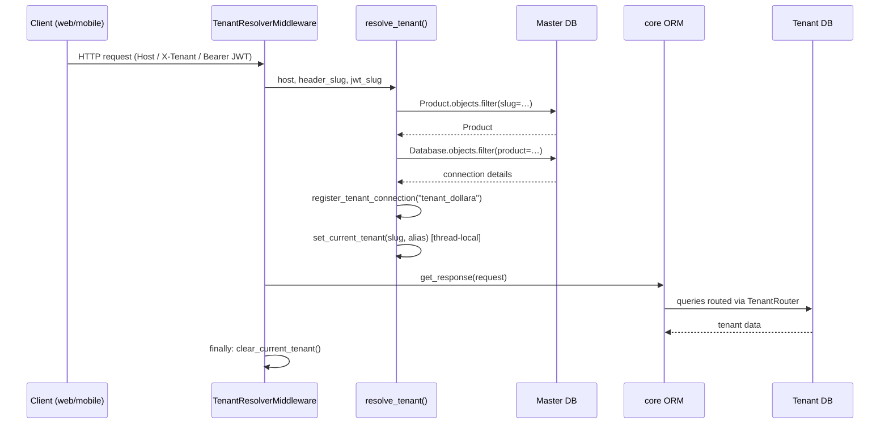

**Web tenant propagation:** `dollara/web/src/middleware.js` derives the slug from
host/subdomain (or `?tenant=` / cookie / default) and writes both an `x-tenant` request
header and an `x-tenant` cookie. The client `services/tenant.js` reads that cookie so
every `fetch` carries `X-Tenant`. **Mobile** hardcodes `TENANT_SLUG` per build
(`src/tenant.js`, default `dollara`) and always sends `X-Tenant`.

---

## 7. Authentication & Authorization

There are **three independent identity domains**, each with its own users table and JWT:

| Domain | Where users live | Login endpoint | Roles | Token store (client) |
|---|---|---|---|---|
| Platform Super Admin | master `users` table | `POST /api/v1/super-admin/auth/login` | `super_admin` | `super_admin_token` (localStorage) |
| Product Admin/Staff | tenant `users` (role `admin`/`super_admin`) | `POST /api/v1/admin/auth/login` | `admin`, `super_admin` | `admin_token` (localStorage) |
| Product Player | tenant `users` (role `user`) | `POST /api/v1/auth/login`, OTP register, demo | `user` | `token` (localStorage / AsyncStorage) |

### JWT mechanics

- Signed with **HS256** using `JWT_SECRET`, 7‑day expiry
  ([`core/auth_jwt.py`](dollara/api/core/auth_jwt.py)).
- `sub` is the user id (stringified on sign, normalized back to int on decode).
- The product API embeds the resolved **`tenant`** claim so the API can re‑resolve the
  tenant even without a host header.
- Demo players get an extra `type: 'demo'` claim.

### Middleware + guard

`JWTAuthenticationMiddleware` attaches `request.auth` (an `AuthUser` with `sub`, `role`,
`type`) when a valid `Bearer` token is present — it does **not** reject; views enforce
roles. The `require_auth([...roles])` decorator
([`core/middleware.py`](dollara/api/core/middleware.py)):

1. 401 if no `request.auth`;
2. 403 if the role isn't allowed (`admin` in the allow‑list expands to `{admin,
   super_admin}` via `STAFF_ROLES`);
3. for `user` tokens, an extra existence check (401 "log in again") so deleted/stale
   players can't act on a still‑valid token.

```mermaid
sequenceDiagram
  participant U as User
  participant API as Product API
  participant DB as Tenant DB
  U->>API: POST /api/v1/auth/login {phone, password}
  API->>DB: User where phone, role=user, status=active
  DB-->>API: user + password_hash
  API->>API: bcrypt.checkpw
  API->>API: sign_token({sub, role:user, [type:demo]}, tenant)
  API-->>U: { token, userId }
  Note over U,API: client stores token; sends Bearer on every call
  U->>API: GET /api/v1/wallet (Bearer)
  API->>API: middleware → request.auth; require_auth(['user'])
  API->>DB: wallet for sub
  API-->>U: balances
```

**Super Admin sessions** additionally enforce **single active session**: on login, all
prior `UserSession` rows for that admin are deactivated and a new one is recorded with IP,
user agent, device type, and 7‑day expiry
([`super_admin/api/tenants/views.py#super_admin_login`](super_admin/api/tenants/views.py)).

### Registration & OTP

`POST /api/v1/auth/register/otp` requires a previously verified OTP. Flow:
`otp/send` → (dev: OTP printed/returned) → `otp/verify` → `register/otp` which creates the
user, a wallet seeded with the welcome bonus, and `UserSetting` (with a generated AI voice
exec id), returning a JWT. OTPs are bcrypt‑hashed, expire in 5 min, and allow 3 attempts
([`core/services.py`](dollara/api/core/services.py)).

> **Note:** OTP delivery is **not** integrated — `send_otp` logs/returns the code in
> `DEBUG`. Twilio/MSG91 env keys are placeholders.

---

## 8. Branding & Theme System

Branding and theme are **authored in Super Admin / master DB** and **consumed by product
front ends at runtime**. They are two distinct concerns:

- **Branding** = data (product name, logo, colors, support email/phone, legal URLs). It
  parameterizes whatever theme is active.
- **Theme** = a *complete* UI/UX (its own chrome + its own version of every page). The
  super admin picks exactly one live theme per product.

### Branding flow

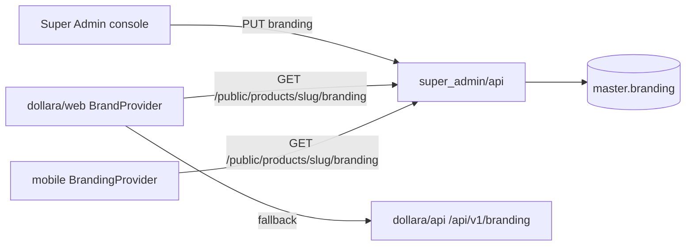

- Web: [`hooks/useBranding.jsx`](dollara/web/src/hooks/useBranding.jsx) fetches branding
  via [`services/tenant.js#fetchBranding`](dollara/web/src/services/tenant.js), sets CSS
  variables (`--brand`, `--accent`), document title, and favicon. It prefers the platform
  public endpoint and falls back to the product API's `/api/v1/branding`.
- Mobile: [`src/branding.js`](dollara/mobile/src/branding.js) provides `useBranding()` and
  `useThemeColors()` (merges brand colors over base tokens).

### Theme flow (the "live theme" model)

Per [the theme architecture](.claude/projects/e--Dancika-shamb-01/memory/theme-selection-architecture.md):

- **Single source of truth for valid keys:**
  [`super_admin/api/tenants/themes.py`](super_admin/api/tenants/themes.py) — `THEME_CATALOG`
  (`theme1` "Classic", `theme2` "Aurora"), `THEME_KEYS`, `DEFAULT_THEME='theme1'`.
- **Storage:** master **`product_themes`** table — one row per catalog theme per product,
  with `is_active` (exactly one = the live theme) and `is_enabled`. Logic lives in
  `themes.py`: `ensure_product_themes()` (idempotent seed, guarantees exactly one active),
  `set_active_theme()` (activating one deactivates the rest), `get_active_theme()`.
- **Super Admin UI:** `products/page.jsx#ThemesModal` is a table — Activate (make live),
  Enable/Disable toggle; changes apply immediately.
- **Public endpoint product FE reads:** `GET /api/v1/public/products/<slug>/theme`
  (unauthenticated). Disabled products return `active_theme: null` (maintenance state).
- **FE rendering** (`dollara/web`):
  - `ProductThemeProvider` (`hooks/useProductTheme.jsx`) resolves the active key app‑wide
    (defaults to `theme1` until the platform responds, so there's no blank flash).
  - `themes/registry.js` maps `key → { Shell, pages }`.
  - `themes/ThemeShell.jsx` renders the active theme's **shell** (chrome) once in
    `app/layout.jsx`.
  - `themes/ThemePage.jsx` (`<ThemePage routeKey="home">`) renders the active theme's page
    for a route, falling back to the default theme's page, then to `children`.
  - **Every** player route (`app/<route>/page.jsx`) is a thin `<ThemePage routeKey="…">`
    dispatcher (route keys: `home, login, register, deposit, withdraw, profile,
    onboarding, support, games, play`). Dynamic routes (`games/[category]`, `play/[slug]`)
    have the *themed* page read `useParams()` itself.
  - `/admin/*` routes are untouched — each shell early‑returns `children` for paths under
    `/admin`. `not-found.jsx` stays shared.

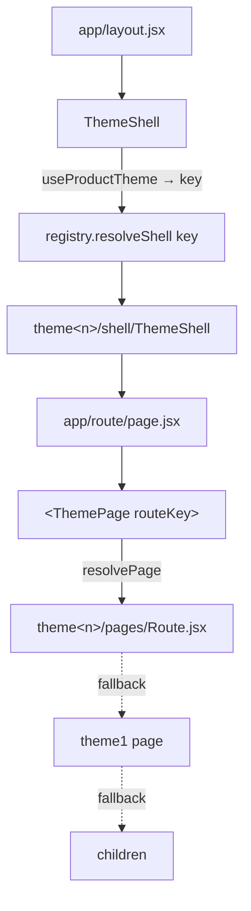

> **Adding a theme** = a catalog entry in `themes.py` + a folder
> `dollara/web/src/themes/<key>/{shell,pages}` + a `registry.js` entry. Every product
> auto‑gets a `product_themes` row for it via `ensure_product_themes`.

**theme1** = the original Dollara look (`Header`/`Footer` chrome + amber/gold dark UI).
**theme2** = "WAXCASINO" style (dark navy, hover‑expand left icon sidebar, sticky topbar
with balance + Deposit, full footer; uses explicit hex colors and ignores the light/dark
toggle). Shared theme2 primitives live in `themes/theme2/components/ui.jsx`.

There is also an *unrelated* **light/dark toggle** for theme1 (`store/theme.js`,
`ThemeToggle.jsx`, `ThemeHydrate.jsx`) that toggles a `light` class on `<html>`.

---

## 9. The Gaming Module (Aggregator Integration)

The most security‑critical and cleanly‑architected subsystem. It integrates an **external
game aggregator**: games run in an **iframe** served by the provider; bets and wins are
settled back into the player wallet via a **secure, idempotent, transaction‑safe
callback**. It is a clean reimplementation of the legacy PHP platform analysed in
[`dollara/games.md`](dollara/games.md) (see also [`dollara/api/docs/GAMES.md`](dollara/api/docs/GAMES.md)).

### Layers

| Layer | File | Responsibility |
|---|---|---|
| Controller | `core/views.py` (`games_launch`, `games_callback`, …) | HTTP only: parse, auth, map error codes → status |
| Validation | `core/game_schemas.py` | `LaunchRequest`, `CallbackPayload` normalize/validate |
| Service | `core/game_services.py` | Launch, settlement, reporting business logic |
| Admin service | `core/game_admin_services.py` | Status toggle, GGR analytics, leaderboards |
| Repository | `core/repositories.py` | All ORM/data access + row locking |
| **Provider** | `services/game_provider.py` | **Only** wire layer: AES‑256‑ECB crypto + aggregator HTTP |
| Models | `core/models.py` | `Game`, `GameSession`, `GameRound`, `GameCallbackLog` |

All provider credentials/keys/URLs come from `settings.GAME_PROVIDER` (env), never
hardcoded.

### Launch flow

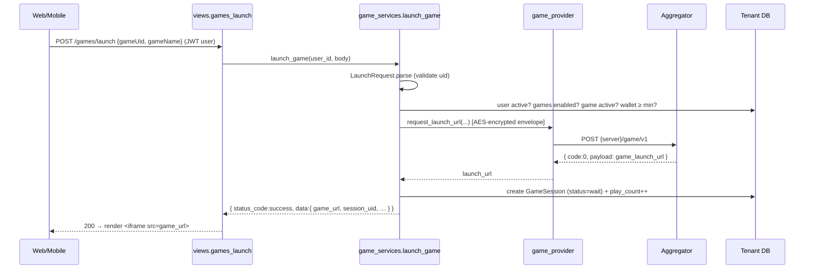

Launch validation maps to HTTP status via `_GAME_ERROR_STATUS`: `auth_error` 401,
`account_error`/`game_off` 403, `invalid_params` 400, `game_not_found` 404,
`balance_error` 402, `server_error` 502. A **mock mode** (`GAME_MOCK_LAUNCH=1`, or DEBUG
with a placeholder `GAME_SERVER_URL`) serves a local placeholder page
(`/api/v1/games/mock-launch`) so the flow works without provider credentials.

The web `useGamePlay` hook **auto‑launches** an aggregator game once the player is logged
in (`isAggregatorGame = Boolean(game.game_uid)`); non‑aggregator games fall back to a
local "place bet" form.

### Callback settlement (the critical path)

`POST /api/v1/games/callback` is **public** — its authentication *is* the AES‑encrypted
payload. `process_callback` guarantees:

```mermaid
sequenceDiagram
  participant AGG as Aggregator
  participant V as views.games_callback
  participant S as process_callback
  participant DB as Tenant DB

  AGG->>V: POST /games/callback { payload: <AES> }
  V->>S: process_callback(envelope, raw)
  S->>S: 1. parse_callback → decrypt
  S->>S: 2. CallbackPayload.parse (validate)
  S->>S: 3. resolve user_id from member_account (strip prefix)
  alt heartbeat (bet==win==0)
    S->>DB: read balance → ack (no writes)
  else known serial_number (pre-check)
    S->>DB: read balance → ack (idempotent)
  else settle
    S->>DB: tenant_atomic + SELECT … FOR UPDATE wallet
    S->>DB: INSERT game_round (UNIQUE serial_number)
    Note over S,DB: duplicate serial → IntegrityError BEFORE money moves
    S->>DB: wallet.main += (win-bet); wagering -= bet (floor 0)
    S->>DB: accumulate session totals + profit/loss
    S->>DB: INSERT bet_settlement Transaction (ledger)
  end
  S->>DB: ALWAYS log GameCallbackLog (settled/duplicate/heartbeat/error/rejected)
  S-->>V: encrypted ack { code:0, msg, payload:{credit_amount, timestamp} }
  V-->>AGG: 200
```

**Idempotency is enforced at three levels** so retried/duplicate deliveries never
double‑settle:

1. **Fast pre‑check** — known `serial_number` → re‑ack without opening a transaction.
2. **Unique DB constraint** — `game_rounds.serial_number` is `UNIQUE`; the round row is
   inserted *before* the wallet write, so a racing duplicate raises `IntegrityError`
   before any money moves (caught as `_DuplicateRound`, treated as idempotent success).
3. **Race‑loss handling** — if two callbacks race, the loser re‑acks the current balance.

Every callback — settled, duplicate, heartbeat, error, or rejected — is recorded in
`game_callback_logs` (raw + decrypted payload + outcome), replacing the legacy
`bet_logs.txt`.

### Crypto (provider service)

AES‑256‑ECB, PKCS#7 padding, base64 transport
([`services/game_provider.py`](dollara/api/services/game_provider.py)).
`build_member_account` namespaces the internal user id behind `GAME_PLAYER_PREFIX`;
`strip_member_account` reverses it on callbacks. `_key_bytes` coerces the configured
secret to a valid AES key length (16/24/32 bytes) so misconfig fails loudly.

### Wagering balance

`wallets.wagering_balance` (replacing the legacy `tbl_requiredplay_balance`) is the
outstanding wagering requirement; each settlement decrements it by the wagered amount
(floored at 0). It's the hook for "must wager before withdraw" policy.

### Admin gaming surface (`game_admin_services.py`)

Master games on/off toggle (stored in `platform_settings.game_status`), 24h/all‑time
**GGR** (gross gaming revenue = bet − win), daily P&L series, top‑games leaderboard, and
searchable round history.

> **Catalog note:** [`GAMES.md`](dollara/api/docs/GAMES.md) states the 263‑game catalog is
> embedded in `database/init.sql`. The project memory mentions a `seed_games` management
> command + generated `_game_catalog.py`; **neither exists in this snapshot** — the
> authoritative source today is `init.sql`. Treat the `seed_games` reference as
> aspirational/removed.

---

## 10. Component: `super_admin/api` (Control Plane API)

**Port 8000.** Operates exclusively on the master DB; provisions/inspects tenant DBs.
Deployed at `admin.ultraconic.com`.

**App layout:** `config/` (settings, urls, health), `core/` (per‑tenant model mirror used
only for cross‑tenant user inspection; `seed_master` command), `middleware/db_router.py`,
`services/` (`branding`, `tenant_provisioning`, `tenant_resolver`), `tenants/` (master
models, views, `themes.py`, `auth_jwt.py`, `auth_middleware.py`, `urls.py`, `state.py`).

### Provisioning (`services/tenant_provisioning.py`)

`provision_product(...)` is the end‑to‑end "Create Product":

1. `update_or_create` the master `Product` (idempotent);
2. `ensure_product_themes` (seed theme rows, theme1 active);
3. upsert `Branding` and `Url`;
4. upsert `Database` row (defaults: `<slug>_db`, master host/creds);
5. shell out to the `mysql` CLI: `CREATE DATABASE IF NOT EXISTS` then apply
   `TENANT_SCHEMA_PATH` (`database/init.sql`) — `CREATE TABLE IF NOT EXISTS`, so re‑runs
   don't destroy data;
6. register the tenant connection and mark `is_provisioned = True`.

> Requires the `mysql` client binary on the host. `db_password` is passed via `MYSQL_PWD`
> env to avoid it appearing in the process list.

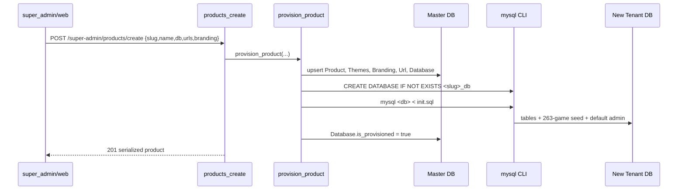

### Endpoint map (`tenants/urls.py`)

All under `/api/v1/`. Auth = `super_admin` JWT unless noted.

| Method | Path | Purpose |
|---|---|---|
| GET | `/health` | Liveness |
| POST | `super-admin/auth/login` | Login (single active session) |
| GET | `super-admin/products` | List products (serialized: branding, themes, urls, db) |
| POST | `super-admin/products/create` | Create + provision |
| GET | `super-admin/products/<slug>` | Detail |
| PATCH | `super-admin/products/<slug>/update` | Rename / change slug / status |
| POST | `super-admin/products/<slug>/disable` | Disable (status) |
| DELETE | `super-admin/products/<slug>/delete` | Delete control‑plane records (DB kept) |
| POST | `super-admin/products/<slug>/provision` | (Re)create + seed tenant DB |
| PATCH | `super-admin/products/<slug>/database` | Edit DB connection |
| GET/PUT | `super-admin/products/<slug>/urls` | FE/BE URLs |
| GET/PUT | `super-admin/products/<slug>/branding` | Branding |
| GET | `super-admin/themes` | Theme catalog |
| GET | `super-admin/products/<slug>/themes` | Per‑product theme rows |
| POST | `super-admin/products/<slug>/themes/activate` | Set live theme |
| PATCH | `super-admin/products/<slug>/themes/<key>/enabled` | Enable/disable a theme |
| POST | `super-admin/test-connection` | Probe FE/BE URL or DB connectivity |
| GET | `super-admin/products/<slug>/users` | Cross‑tenant user peek (switches DB context) |
| GET | `public/products/<slug>/branding` | **Public** branding for product FE |
| GET | `public/products/<slug>/theme` | **Public** live theme for product FE |

`test_connection` does an HTTP HEAD/GET (TLS verification disabled) for URLs, or a direct
`MySQLdb.connect` for databases. `product_users` resolves + `use_tenant()`s into the
tenant DB and reads `core.models.User` (the only place this API touches a tenant DB's
feature tables).

### `seed_master` command

Creates the platform super admin (`superadmin` / `Admin@123`) and provisions three initial
products (`dollara`, `productb`, `productc`), each with its own tenant DB. `--skip-provision`
creates only master records.

---

## 11. Component: `super_admin/web` (Control Plane Console)

**Port 3001.** Next.js App Router console. Plain `localStorage` JWT (`super_admin_token`),
no zustand. Light/dark via a small `ThemeProvider` (`sa_theme`).

| Route | File | Purpose |
|---|---|---|
| `/login` | `app/login/page.jsx` | Super‑admin login |
| `/` | `app/page.jsx` | Overview (counts + recent products) inside `DashboardLayout` |
| `/products` | `app/products/page.jsx` (862 LOC) | Full product CRUD + modals |
| (shared) | `app/components/DashboardLayout.jsx` | Sidebar/topbar chrome + `useDashboard()` context |

`app/products/page.jsx` is the heart of the console. It contains:

- **`EditProductModal`** — name/slug/status, DB connection edit, URLs, *Test connection*.
- **`BrandingModal`** — all branding fields, live preview.
- **`ThemesModal`** — the per‑product theme table (Activate / Enable‑Disable), applying
  immediately via `activateProductTheme` / `setProductThemeEnabled`.
- **`ProductsContent`** — the grid/list with create + provision + disable + delete.

All API calls go through `services/api.js`, which centralizes the `super_admin_token`
header, 401→redirect‑to‑login handling, and one named function per endpoint.

---

## 12. Component: `dollara/api` (Product Backend)

**Port 5000 (ASGI via Daphne).** Serves a single resolved tenant. Three surfaces: REST
(`core/urls.py`), GraphQL (`/graphql`), WebSocket (`/ws`).

### Module map

| Module | Responsibility |
|---|---|
| `config/settings.py` | DB‑per‑tenant config, middleware order, JWT, `GAME_PROVIDER`, mock‑launch, CORS |
| `config/asgi.py` | `ProtocolTypeRouter` (HTTP = Django, WS = Channels) |
| `core/views.py` | All REST controllers (auth, settings, wallet, games, geo, admin, AI) |
| `core/services.py` | Player/admin business logic (auth, OTP, wallet, deposits/withdrawals, bets, dashboards) |
| `core/admin_services.py` | Admin panel logic (users, txns, games, providers, bonuses, settings, charts) |
| `core/game_services.py` | Gaming launch + idempotent callback settlement + reporting |
| `core/game_admin_services.py` | Gaming status toggle + GGR analytics |
| `core/game_schemas.py` | Launch/callback validators |
| `core/repositories.py` | Gaming data access + wallet locking |
| `core/ai/services.py` | PyTorch fraud MLP, welcome‑call script, chatbot |
| `core/graphql_schema.py` | Strawberry schema (`me`, `wallet`, `games`, dashboard, tickers) |
| `core/consumers.py` + `core/routing.py` | WebSocket live ticker (`/ws`) |
| `core/geo.py` | IP→country/currency/payment‑methods config |
| `core/middleware.py` + `core/auth_jwt.py` | JWT middleware + `require_auth` + token helpers |
| `services/game_provider.py` | Aggregator wire protocol (AES + HTTP) |
| `services/branding.py` | Branding serialization from master DB |
| `services/tenant_resolver.py` | Tenant resolution + dynamic connection registration |
| `middleware/tenant.py`, `middleware/db_router.py` | Tenant middleware + DB router |
| `tenants/models.py`, `tenants/state.py`, `tenants/views.py` | Master mirror + thread‑local + public branding view |

### Wallet & money flow

- **Deposit:** `create_deposit` opens a `pending` `Transaction`; `confirm_deposit`
  (player or admin) credits `main_balance` under `tenant_atomic` + `select_for_update`.
- **Withdrawal:** `create_withdrawal` validates available balance (`main − locked`) and a
  ₹500 minimum, opens a `pending` transaction, **locks** the amount, creates five
  `WithdrawalStage` rows, then `process_withdrawal_stages` auto‑approves → `processing`.
  Admin `approve`/`reject` complete it (reject unlocks the funds back to `main`).
- **Bet (non‑aggregator):** `place_bet` locks the wallet, checks balance, debits
  `main_balance`, creates a `Bet`, increments `play_count`.
- **Aggregator settlement:** handled entirely by `game_services._settle` (see §9).

`available = main − locked` is the spendable balance everywhere on the backend (the mobile
wallet store computes a slightly different `main + bonus − locked − exposure` locally).

### AI (`core/ai/services.py`)

- `FraudNet` — an 8‑input MLP (Xavier‑init, eval‑only; **not trained** — weights are
  random) producing a 0–100 score, risk level, contributing factors, and an
  approve/review/reject recommendation. Admin‑only `POST /api/v1/ai/fraud-score`.
- `welcome_call` — returns a scripted welcome‑call transcript (logged to `ai_call_logs`).
- `chat_respond` — keyword‑matched canned support replies (deposit/withdraw/bonus).

These are deterministic stand‑ins for real models/telephony/LLM integrations.

---

## 13. Component: `dollara/web` (Product Web App)

**Port 3000.** Next.js App Router. Two distinct surfaces share the codebase: the
**player** app (theme‑dispatched) and the **`/admin`** console (its own shell, untouched by
themes).

### Provider stack (root layout)

```
<ThemeHydrate>          ← light/dark class (theme1)
  <BrandProvider>       ← branding → CSS vars, title, favicon
    <ProductThemeProvider>   ← active theme key (theme1/theme2)
      <AuthHydrate>     ← restore JWT from localStorage, refresh session
        <ThemeShell>{children}</ThemeShell>   ← active theme's chrome
```

### Routing

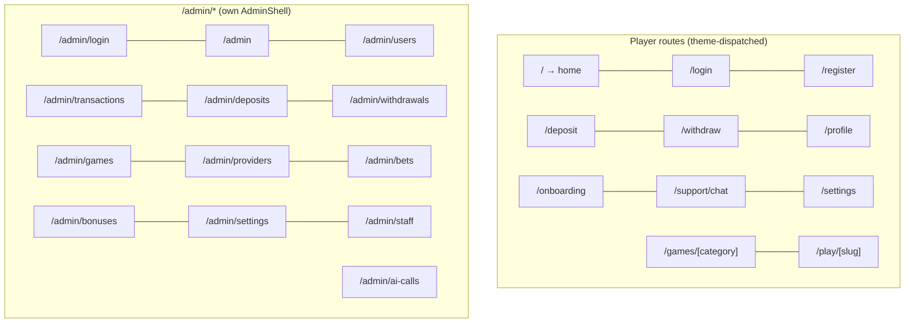

- **Player routes** are thin `<ThemePage routeKey="…">` dispatchers; the active theme owns
  the rendered UI (see §8). Auth gating uses `useGuestOnly` (redirect logged‑in users off
  `/login`/`/register`) and per‑page checks.
- **`/admin`** uses `AdminShell` (`components/admin/AdminShell.jsx`), a ~720‑line module
  that bundles the sidebar/topbar chrome **and** a full admin component library:
  `Card`, `StatCard`, `Button`, `Field`, `Input`, `Select`, `Toggle`, `Modal`,
  `EmptyState`, `StatusBadge`, `DataTable` (search + pagination + skeletons), `BarChart`,
  `ChartLegend`, the `useAdminData` fetch hook, and `inr`/`fmtDate` helpers. `AdminShell`
  redirects to `/admin/login` if no `admin_token`. SweetAlert2 powers `toast` + `confirmDialog`.

### Services, hooks, store

| Kind | File | Role |
|---|---|---|
| Service | `services/tenant.js` | `API_URL`/`PLATFORM_API_URL`, slug resolution, `tenantHeaders`, `fetchBranding`, `fetchActiveTheme` |
| Service | `services/api.js` | Authed `fetch` wrapper (player token) |
| Service | `services/adminApi.js` | Admin token mgmt + `adminApi` + `adminLogin` (401→`/admin/login`) |
| Service | `services/graphql.js` | `graphql()` + `fetchMe()` (used by auth store) |
| Hook | `hooks/useBranding.jsx` | Branding context + CSS var application |
| Hook | `hooks/useProductTheme.jsx` | Active theme key context |
| Hook | `hooks/useGameCatalog.js` | Fetch game list |
| Hook | `hooks/useGamePlay.js` | Per‑game launch/bet logic + auto‑launch |
| Hook | `hooks/useGuestOnly.js` | Redirect authed users away from guest pages |
| Store | `store/auth.js` (zustand) | token/user/wallet, `setAuth`/`hydrate`/`refreshSession`/`logout` |
| Store | `store/theme.js` (zustand) | light/dark toggle |
| Lib | `lib/gameRoutes.js` | Category slug↔API mapping, filter/search helpers, `playPath` |

The auth store's `refreshSession` fetches `me` (GraphQL) + wallet (REST) in parallel and
logs out if both fail.

---

## 14. Component: `dollara/mobile` (Product Mobile App)

React Native (Android + iOS), shipped per product (white‑label by `src/config.js`:
`API_URL`, `PLATFORM_API_URL`, `TENANT_SLUG`, default branding). On Android emulator,
`API_URL` defaults to `http://10.0.2.2:5000`.

### Navigation (`src/navigation/RootNavigator.js`)

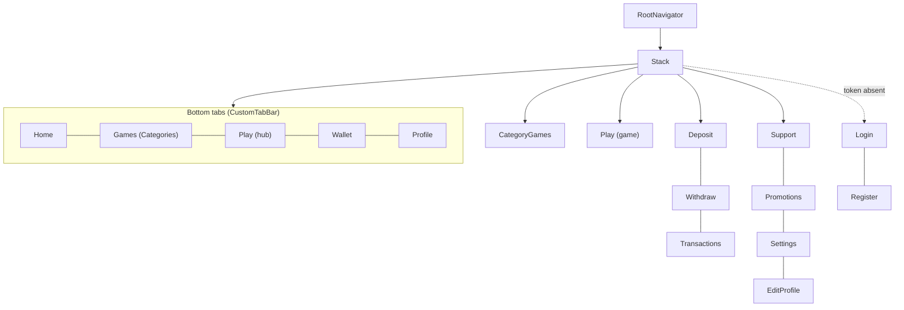

- A splash screen shows while auth hydrates; `Login`/`Register` are only registered as
  stack screens when there's no token.
- **Screens** (`src/screens/`): Login, Register, Home, Games, PlayHub, CategoryGames,
  Wallet, Profile, Play, Deposit, Withdraw, Transactions, Support, Settings, Promotions,
  EditProfile.
- **Components** (`src/components/`): BalanceCard, Button, Card, CustomTabBar, EmptyState,
  GameCard, Icon, Input, MenuRow, PasswordInput, TransactionRow, WalletBar.

### State & services

- `store/auth.js` — zustand + AsyncStorage. Persists token + cached `me`; detects demo
  tokens by decoding the JWT `type` claim; refreshes session (GraphQL `me` + wallet).
- `store/walletStore.js` — wallet + transactions, AsyncStorage‑cached, with
  `deposit`/`confirmDeposit`/`withdraw`/`placeBet` (each calls the API then reloads). Note
  the local `computeAvailable` (`main + bonus − locked − exposure`) differs from the
  backend's `main − locked`.
- `services/api.js` — `fetch` wrapper that always sends `X-Tenant`, plus `fetchBranding`
  (platform endpoint → product fallback) and `fetchMe` (GraphQL).
- `branding.js` — `BrandingProvider`, `useBranding`, `useThemeColors`.

The mobile app calls the **same** product API endpoints as web (login/demo, wallet,
games/bet, transactions), so the backend contract is shared.

---

## 15. Database Schema Reference

### 15.1 Master / Control‑Plane DB (`super_admin/api/database/master.sql`)

```mermaid
erDiagram
  products ||--o| branding : has
  products ||--o| urls : has
  products ||--o| databases : has
  products ||--o{ product_themes : has
  users ||--o{ user_sessions : has

  products {
    bigint id PK
    varchar slug UK
    varchar name
    enum status "active|disabled"
  }
  product_themes {
    bigint id PK
    bigint product_id FK
    varchar theme_key
    bool is_active "exactly one true per product"
    bool is_enabled
  }
  branding {
    bigint product_id FK,UK
    varchar product_name
    varchar logo_url
    varchar theme_color
    varchar secondary_color
    varchar support_email
  }
  urls { bigint product_id FK,UK; varchar fe_url; varchar be_url }
  databases {
    bigint product_id FK,UK
    varchar db_name
    varchar db_host
    varchar db_user
    bool is_provisioned
  }
  users { bigint id PK; varchar username UK; varchar password_hash; bool is_active }
  user_sessions {
    bigint id PK
    bigint user_id FK
    varchar session_token UK
    bool is_active "one active per user"
    datetime expires_at
  }
```

| Table | Purpose | Notes |
|---|---|---|
| `products` | Tenant catalog | `slug` is the tenant key; `status` gates the public theme |
| `product_themes` | Per‑product theme rows | exactly one `is_active`; `is_enabled` hides from activation |
| `branding` | White‑label branding | 1:1 with product |
| `urls` | FE/BE URLs | 1:1 |
| `databases` | Tenant DB connection details | host/port/user/password/`is_provisioned` |
| `users` | Platform super admins | seeded `superadmin`/`Admin@123` |
| `user_sessions` | Active super‑admin sessions | single‑session enforcement |

### 15.2 Tenant DB (`dollara/api/database/init.sql`) — 26 tables

Tables actively used by the code are bolded; the rest are forward‑looking schema.

```mermaid
erDiagram
  users ||--o| user_settings : has
  users ||--o| wallets : has
  users ||--o{ transactions : makes
  transactions ||--o{ withdrawal_stages : has
  users ||--o{ bets : places
  game_providers ||--o{ games : offers
  games ||--o{ bets : on
  users ||--o{ game_sessions : launches
  games ||--o{ game_sessions : in
  game_sessions ||--o{ game_rounds : settles
  users ||--o{ game_rounds : owns
  users ||--o{ ai_call_logs : receives
  bonuses ||--o{ user_bonuses : granted

  users { bigint id PK; varchar phone UK; enum role; enum account_status }
  wallets {
    bigint user_id FK,UK
    decimal main_balance
    decimal bonus_balance
    decimal locked_balance
    decimal wagering_balance
  }
  transactions { bigint id PK; bigint user_id FK; enum type; decimal amount; enum status }
  games { bigint id PK; varchar slug UK; enum category; varchar game_uid; bool is_active }
  game_sessions {
    bigint id PK
    varchar session_uid UK
    bigint user_id FK
    varchar game_uid
    decimal total_bet
    decimal total_win
    decimal profit_loss
  }
  game_rounds {
    bigint id PK
    bigint session_id FK
    varchar serial_number UK "idempotency key"
    decimal bet_amount
    decimal win_amount
  }
  game_callback_logs { bigint id PK; varchar serial_number; enum result; json decrypted_payload }
```

**Core / actively‑used tables**

| Table | Key columns | Used by |
|---|---|---|
| **users** | `role` (user/admin/super_admin), `account_status`, `phone` UK | auth, admin, everything |
| **user_settings** | kyc_status, is_demo, languages, currency, `ai_voice_executive_id` | preferences, demo, AI |
| **wallets** | main/bonus/exposure/locked/**wagering** balance | wallet, bets, settlement |
| **otp_verifications** | `otp_hash`, attempts, expires_at | OTP register |
| **transactions** | type, amount, status, reference_number | deposits, withdrawals, settlement ledger, adjustments |
| **withdrawal_stages** | 5‑stage pipeline | withdrawal workflow |
| **bonuses** | type/value/wagering_multiplier | admin bonuses; `welcome100` seeded |
| **game_providers** | 7 aggregator providers seeded | catalog |
| **games** | `category`, `game_uid`, `game_type`, `is_active` | catalog, launch |
| **bets** | bet_amount, odds, payout, status | non‑aggregator bets |
| **game_sessions** | `session_uid`, accumulated totals, status | launch + settlement |
| **game_rounds** | `serial_number` **UNIQUE** | idempotent settlement |
| **game_callback_logs** | raw + decrypted + result | callback audit |
| **platform_settings** | key/JSON value (`game_status`, etc.) | global toggles |
| **ai_call_logs** | transcript, deposit_intent | welcome calls |

**Forward‑looking / schema‑only tables** (defined in `init.sql`, no code paths yet):
`kyc_documents`, `bank_accounts`, `user_bonuses`, `agents`, `affiliates`,
`support_tickets`, `ticket_messages`, `blocked_ips`, `notifications`, `login_history`,
`admin_audit_logs`.

**Seed data** (in `init.sql`): default admin (`superadmin`/`Admin@123`), platform settings
(`site_name`, languages, min deposit 100, min withdrawal 500, auto‑approve limit 10000,
`game_status: {enabled:true}`), `welcome100` bonus, 7 game providers, and **263 games**
with thumbnails.

> Schema is applied by importing the SQL file; Django migrations are disabled.

---

## 16. API Reference

Base path for product API: `http://<host>:5000/api/v1`. Auth header: `Authorization:
Bearer <jwt>`. Tenant header: `X-Tenant: <slug>` (or resolved by host).

### 16.1 Product API — Player (role `user`)

| Method | Path | Auth | Body / Query | Notes |
|---|---|---|---|---|
| POST | `/auth/otp/send` | — | `{phone, channel?}` | Dev returns OTP |
| POST | `/auth/otp/verify` | — | `{phone, otp}` | |
| POST | `/auth/register/otp` | — | `{fullName, phone, password, countryCode?}` | OTP must be verified first |
| POST | `/auth/demo` | — | — | 30‑min demo session, ₹50k/₹5k |
| POST | `/auth/login` | — | `{phone, password}` | → `{token, userId}` |
| GET/PUT/PATCH | `/settings` | user | preference fields | editable: languages, currency, notifications, marketing |
| GET | `/wallet` | user | — | balances + `available` |
| POST | `/wallet/deposit` | user | `{amount, paymentMethod, currency?}` | opens pending tx |
| POST | `/wallet/deposit/<tx>/confirm` | user/admin | `{referenceNumber}` | credits main |
| POST | `/wallet/withdraw` | user | `{amount, paymentMethod}` | min ₹500; locks funds |
| GET | `/wallet/transactions` | user | — | last 50 |
| GET | `/games` | — | `category, featured, limit, offset` | catalog |
| GET | `/games/trending` | — | — | top 12 |
| POST | `/games/bet` | user | `{gameId, amount, odds?}` | non‑aggregator |
| POST | `/games/launch` | user | `{gameUid, gameName}` (legacy `GAME_UID` ok) | → launch URL |
| GET | `/games/history` | user | `limit, offset` | session history |
| GET | `/games/pnl` | user | — | aggregate P&L |
| POST | `/games/callback` | **AES** | encrypted payload | aggregator settlement |
| GET | `/games/mock-launch` | — | `game_uid` | dev placeholder frame |
| GET | `/geo/detect` | — | — | country/currency/payment methods |
| GET | `/branding` | — | (tenant) | fallback branding |
| POST | `/graphql` | optional | GraphQL | `me`, `wallet`, `games`, `trendingGames`, `adminDashboard`, `liveTickers` |
| WS | `/ws` | — | — | live ticker feed |

### 16.2 Product API — Admin (role `admin`/`super_admin`)

| Method | Path | Purpose |
|---|---|---|
| POST | `/admin/auth/login` | Admin login |
| GET | `/admin/dashboard`, `/admin/dashboard/charts`, `/admin/activity` | KPIs, charts, feed |
| GET/PATCH | `/admin/users`, `/admin/users/<id>`, `/admin/users/<id>/status` | Users + status/KYC/fraud |
| POST | `/admin/users/<id>/wallet/adjust` | Manual wallet adjustment (ledgered) |
| GET | `/admin/transactions`, `/admin/deposits/pending` | Finance |
| POST | `/admin/deposits/<tx>/confirm` | Confirm deposit |
| GET/POST/PATCH | `/admin/games`, `/admin/games/create`, `/admin/games/<id>` | Game catalog |
| GET/PUT | `/admin/games/status`, `/admin/games/status/set` | Master games switch |
| GET | `/admin/games/statistics`, `/admin/games/pnl-series`, `/admin/games/top`, `/admin/games/rounds` | Gaming analytics |
| GET/POST/PATCH | `/admin/providers...` | Providers |
| GET | `/admin/bets` | Bets |
| GET/POST/PATCH | `/admin/bonuses...` | Bonuses |
| GET/PUT | `/admin/settings`, `/admin/settings/<key>` | Platform settings |
| GET | `/admin/ai-calls` | AI call logs |
| GET | `/admin/staff` | Staff list |
| GET/POST | `/admin/withdrawals/pending`, `/admin/withdrawals/<tx>/approve|reject` | Withdrawal review |
| POST | `/ai/fraud-score`, `/ai/trigger-welcome-call`, `/ai/chat` | AI features |

### 16.3 Control‑plane API

See [§10](#10-component-super_adminapi-control-plane-api) for the full `super-admin/*` and
`public/*` map.

---

## 17. Startup & Execution Flow

### One‑time platform bootstrap

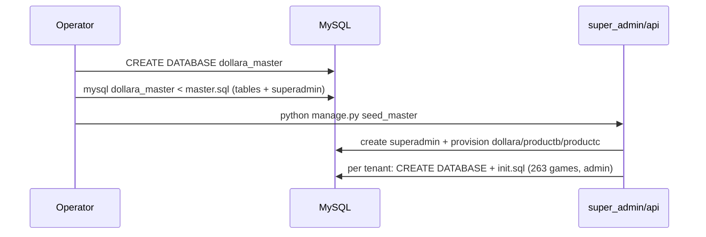

### Product API process startup (`config/asgi.py` → settings)

```mermaid
sequenceDiagram
  participant D as Daphne (ASGI)
  participant S as settings.py
  participant AI as core.ai
  D->>S: load .env, configure default=master DB, register TenantRouter
  S->>S: build GAME_PROVIDER from env
  D->>AI: import → instantiate FraudNet (Xavier init, eval)
  Note over D: HTTP → Django app; WS → Channels URLRouter(/ws)
```

### Per‑request lifecycle (product API)

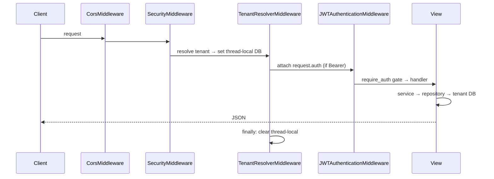

### Web app first paint

`layout.jsx` runs an inline script to set the light/dark class pre‑paint, then mounts the
provider stack. `BrandProvider` fetches branding (applies CSS vars/title/favicon),
`ProductThemeProvider` fetches the live theme key, `AuthHydrate` restores the JWT, and
`ThemeShell` renders the active theme's chrome around the route.

---

## 18. Business Logic & Rules

| Rule | Where | Why |
|---|---|---|
| One product = one isolated DB | `TenantRouter` + resolver | Hard data isolation between brands |
| Exactly one active theme per product | `themes.set_active_theme`/`ensure_product_themes` | Deterministic "live theme" |
| Disabled product → no theme | `public_product_theme` | Lets FE show maintenance |
| Min deposit ₹100 (mobile), min withdrawal ₹500 | wallet store / `create_withdrawal` | Operational floors |
| Withdrawal locks funds immediately | `create_withdrawal` | Prevents double‑spend during review |
| Reject withdrawal unlocks funds | `admin_withdrawal_reject` | Restores balance |
| Welcome bonus on register | `register_with_otp` (`WELCOME_BONUS`) | Acquisition |
| Demo session: 30 min, ₹50k main + ₹5k bonus | `create_demo_session` | Try‑before‑signup |
| Min launch balance (default ₹100) | `game_services.launch_game` | Aggregator launch gate |
| Games master switch | `platform_settings.game_status` | Kill‑switch for all launches |
| Per‑game `is_active` | `games.is_active` | Granular game toggle |
| Callback idempotency (3 levels) | `process_callback` + unique `serial_number` | Never double‑settle |
| Heartbeat (bet==win==0) → no writes | `process_callback` | Balance‑sync pings |
| Wagering balance decremented per bet | `_settle` | Wagering‑before‑withdraw hook |
| Settlement is row‑locked + atomic | `_settle` (`select_for_update`, `tenant_atomic`) | Consistency under concurrency |
| OTP: 5‑min expiry, 3 attempts, hashed | `send_otp`/`verify_otp` | Anti‑bruteforce |
| Single active super‑admin session | `super_admin_login` | Session hygiene |
| `available = main − locked` (backend) | `get_wallet` | Spendable balance |

---

## 19. Configuration Reference

### `dollara/api/.env`

| Var | Purpose |
|---|---|
| `NODE_ENV` | `development` ⇒ `DEBUG=True`, CORS allow‑all |
| `PORT` | API port (default 5000) |
| `DJANGO_SECRET_KEY` / `JWT_SECRET` / `JWT_REFRESH_SECRET` | Secrets (JWT HS256) |
| `ALLOWED_HOSTS` | Comma list |
| `MASTER_MYSQL_*` | Master DB connection (`default`) |
| `MYSQL_*` | Default creds for tenant DBs / single‑tenant fallback |
| `DEFAULT_TENANT` | Slug for localhost (default `dollara`) |
| `GAME_AGENCY_UID` / `GAME_AES_SECRET_KEY` / `GAME_PLAYER_PREFIX` | Aggregator identity + crypto |
| `GAME_SERVER_URL` / `GAME_LAUNCH_PATH` | Aggregator launch endpoint |
| `GAME_MOCK_LAUNCH` | `1` ⇒ local mock frame |
| `GAME_CALLBACK_BASE_URL` / `GAME_HOME_URL` | Callback + lobby URLs |
| `GAME_CURRENCY_CODE` / `GAME_DEFAULT_LANGUAGE` / `GAME_MIN_LAUNCH_BALANCE` / `GAME_HTTP_TIMEOUT` | Launch defaults |
| `WELCOME_BONUS` | Register bonus (default 100) |
| `AWS_*`, `TWILIO_*`, `WHATSAPP_API_TOKEN`, `MSG91_API_KEY` | Integration placeholders (not wired) |

### `super_admin/api/.env`

`MASTER_MYSQL_*`, `MYSQL_*` (for provisioning), `JWT_SECRET`, `PORT` (8000),
`TENANT_SCHEMA_PATH` (override path to `init.sql`).

### Frontend env

| App | Var | Default |
|---|---|---|
| dollara/web | `NEXT_PUBLIC_API_URL` | `http://localhost:5000` |
| dollara/web | `NEXT_PUBLIC_PLATFORM_API_URL` | `http://localhost:8000` |
| dollara/web | `NEXT_PUBLIC_DEFAULT_TENANT` | `dollara` |
| super_admin/web | `NEXT_PUBLIC_API_URL` | `http://localhost:8000` |
| mobile | `API_URL` / `PLATFORM_API_URL` / `TENANT_SLUG` | per `src/config.js` |

### Build config files

| File | App | Notes |
|---|---|---|
| `next.config.mjs` | web apps | `reactStrictMode`, remote image patterns (`https://**` for dollara/web) |
| `tailwind.config.js` / `postcss.config.mjs` | web apps | Tailwind 3.4 |
| `jsconfig.json` | web apps | `@/*` path alias |
| `babel.config.js` / `metro.config.js` | mobile | RN preset + Metro bundler |
| `jest.config.js` | mobile | RN jest preset |
| `android/` `ios/` | mobile | Native projects (Gradle / Xcode) |
| `config/test_settings.py` | dollara/api | SQLite test settings (see §21) |

---

## 20. Build, Run & Deploy

### Local development (recommended order)

```bash
# 1) Master schema (once)
mysql -u root -e "CREATE DATABASE IF NOT EXISTS dollara_master CHARACTER SET utf8mb4;"
mysql -u root dollara_master < super_admin/api/database/master.sql

# 2) Super Admin API (:8000) — also provisions tenant DBs
cd super_admin/api
python -m venv .venv && source .venv/bin/activate   # Windows: .venv\Scripts\activate
pip install -r requirements.txt
cp .env.example .env
python manage.py seed_master          # creates superadmin + dollara/productb/productc DBs
python manage.py runserver 0.0.0.0:8000

# 3) Super Admin Web (:3001)
cd ../web && npm install && cp .env.example .env && npm run dev

# 4) Product API (:5000)
cd ../../dollara/api
python -m venv .venv && source .venv/bin/activate
pip install -r requirements.txt
cp .env.example .env
# (if not seeded by super-admin) mysql dollara_db < database/init.sql
python manage.py runserver 0.0.0.0:5000     # Daphne/ASGI for WS

# 5) Product Web (:3000)
cd ../web && npm install && cp .env.example .env && npm run dev

# 6) Mobile (optional)
cd ../mobile && npm install
npm run start          # Metro
npm run android        # or: npm run ios
```

> On Windows the repo's shell is PowerShell/Git‑Bash; activate venvs accordingly. The
> project memory notes the product API venv may live at
> `dollara/api/venv/Scripts/python.exe`.

### Default credentials

- Super Admin: `superadmin` / `Admin@123`
- Per‑tenant product admin (each tenant DB): `superadmin` / `Admin@123`

### Production notes (from code/READMEs)

- Super Admin → `admin.ultraconic.com`; products → `<product>.com`.
- Product API HTTP path can run under **gunicorn**; WebSockets need the **Daphne/ASGI**
  path. Run behind a reverse proxy that routes `/ws` to the ASGI server.
- Set `NODE_ENV=production` (turns off `DEBUG` and CORS allow‑all — you must then set
  explicit CORS/`ALLOWED_HOSTS`).
- Provisioning needs the `mysql` CLI on the Super Admin host.

---

## 21. Testing

The gaming module has a focused test suite (`dollara/api/core/tests/`):

| File | Covers |
|---|---|
| `test_game_provider.py` | AES round‑trip, launch envelope, member‑account build/strip |
| `test_game_schemas.py` | Launch/callback validation (legacy + new keys) |
| `test_game_services.py` | Launch, settlement, idempotency, heartbeat, wagering |
| `test_game_views.py` | Route + ack behavior |

Run with the dedicated test settings (in‑memory SQLite, migrations re‑enabled so Django
builds tables from models, **no tenant router**):

```bash
cd dollara/api
python manage.py test core.tests --settings=config.test_settings
```

`config/test_settings.py` injects a deterministic `GAME_PROVIDER` (fixed AES key from
`games.md`) so crypto tests are stable. Mobile has a default `__tests__/App.test.tsx`
(Jest + RN preset). No automated tests exist for the web apps or the Super Admin API.

---

## 22. Security Review

**Strengths**

- **Hard tenant isolation** at the DB level; control‑plane app can never migrate onto a
  tenant DB.
- **bcrypt** password & OTP hashing; **HS256 JWT** with expiry and tenant binding.
- **Idempotent, row‑locked, atomic** money settlement — the highest‑risk path is the most
  carefully guarded.
- Aggregator credentials/keys are env‑only; misconfigured keys fail loudly.
- Provisioning passes the DB password via `MYSQL_PWD` (not argv) and uses
  `CREATE … IF NOT EXISTS` (non‑destructive).
- Super Admin single‑active‑session enforcement.
- Callback errors return a generic provider envelope (no internal leakage).

**Risks / recommendations**

| Area | Issue | Recommendation |
|---|---|---|
| Secrets | Default `JWT_SECRET`/`DJANGO_SECRET_KEY` are dev placeholders; bcrypt hash for `Admin@123` is committed in SQL | Rotate all secrets and the default admin password before any non‑local deploy |
| OTP delivery | OTPs are logged/returned in `DEBUG`, never sent | Integrate Twilio/MSG91 and never expose OTP in responses |
| `test_connection` | TLS verification disabled (`CERT_NONE`) | Acceptable for a health probe; keep it strictly admin‑only (it is) and consider SSRF allow‑listing |
| Callback auth | Auth is *solely* possession of the AES key; no source‑IP allow‑list | Add aggregator IP allow‑listing + replay/timestamp window |
| CSRF | All state‑changing views are `@csrf_exempt` (token‑based API) | Fine for a pure JSON API, but ensure no cookie‑auth surface is ever added without CSRF |
| CORS | `CORS_ALLOW_ALL_ORIGINS = DEBUG` | In production set an explicit origin allow‑list |
| Fraud model | `FraudNet` weights are random/untrained | Don't rely on its score for real decisions until trained, or label it advisory |
| Token storage | JWTs in `localStorage` (web) | Acceptable trade‑off; mitigate XSS rigorously, consider httpOnly cookies if feasible |
| Withdrawals | `process_withdrawal_stages` auto‑approves unconditionally | Wire the stages to real checks (KYC, wagering, duplicate, fraud) before production |
| SQL injection | ORM throughout; provisioning interpolates the DB **name** into `CREATE DATABASE` | DB names come from admin input — validate `slug`/`db_name` against a strict charset |

---

## 23. Performance Review

- **Tenant connections are cached** and only re‑registered when config changes
  (`register_tenant_connection` compares before swapping) — good.
- **Repositories use `select_related`** on hot list paths (games, sessions, rounds, txns).
- **Settlement holds a row lock briefly** inside a single atomic block — correct, but high
  callback volume per player will serialize on that wallet row (expected for correctness).
- **In‑memory cache + in‑memory channel layer** (`LocMemCache`, `InMemoryChannelLayer`):
  fine for a single process, but **won't scale horizontally** — the live ticker and OTP
  cache are per‑process. Move to Redis for multi‑worker deployments.
- **WS ticker polls the cache every 5s per connection** (`consumers.py`) — acceptable at
  small scale; prefer a pub/sub fan‑out (Redis channel layer) at scale.
- **Web game pages refetch the full catalog** (`useGameCatalog`/`useGamePlay` request up to
  300 games) and filter client‑side. Fine for ~hundreds of games; paginate/server‑filter
  if the catalog grows large.
- **PyTorch is imported at process start** and a model instantiated even if AI endpoints
  are unused — adds memory/startup cost; consider lazy‑loading.
- `AdminShell.jsx` (~720 LOC) bundles the whole admin component library in one module —
  acceptable but a candidate to split for tree‑shaking/readability.

---

## 24. Code Quality & Technical Debt

**Positives**

- Clear, consistent **clean‑architecture** layering in the product API (views → services →
  repositories → models; provider isolated).
- The gaming module is exemplary: documented, validated, idempotent, tested.
- Theme/branding split is well thought through and centrally controlled.
- Two backends deliberately **mirror** the master models with read‑only vs writable intent.

**Debt / inconsistencies to be aware of**

| Item | Detail |
|---|---|
| Duplicated master state logic | `tenants/state.py`, `middleware/db_router.py`, `auth_jwt.py`, `auth_middleware.py` are near‑copies across both backends — intentional (separate services) but drift‑prone. |
| Duplicated tenant `User`/`UserSetting`/`Wallet`… models | `dollara/api/core/models.py` and `super_admin/api/core/models.py` overlap; the super‑admin copy lacks the gaming extensions. Keep in sync manually. |
| `available` balance formula differs | Backend `main − locked` vs mobile `main + bonus − locked − exposure`. Reconcile to avoid UX/accounting mismatch. |
| Withdrawal stages are cosmetic | Auto‑approve regardless of stage outcome. |
| Fraud model untrained | Advisory only. |
| `seed_games` / `_game_catalog.py` referenced but absent | Catalog lives in `init.sql`; docs/memory are stale here. |
| `geo.detect_geo_from_ip` always returns India | Placeholder geo logic (`country_code = 'IN'` regardless). |
| Stray temp file | `super_admin/web/src/app/components/DashboardLayout.jsx.tmp.*` should be removed. |
| `body.json` deleted in git status | A root `body.json` is marked deleted; ensure no tooling depends on it. |
| Many `init.sql` tables unused | KYC, bank accounts, affiliates, tickets, audit logs, etc. are schema‑only — either implement or document as roadmap. |

**Priority recommendations:** (1) rotate secrets + default admin; (2) wire OTP delivery and
real withdrawal checks before production; (3) move cache/channel layer to Redis for
horizontal scale; (4) reconcile the `available` balance formula; (5) extract the shared
multi‑tenant primitives into a versioned internal package to stop drift.

---

## 25. Glossary

| Term | Meaning |
|---|---|
| **Control plane / Super Admin** | The central service that manages products, branding, themes, and tenant DB provisioning. |
| **Product / Tenant** | A white‑label brand (e.g. Dollara) with its own DB, branding, theme, API, web, mobile. |
| **Master DB** | The control‑plane database holding products/urls/branding/databases/themes/super‑admin users. |
| **Tenant DB** | A product's isolated database (users, wallets, games, transactions, …). |
| **Slug** | A product's stable identifier (e.g. `dollara`); used for tenant resolution and DB alias `tenant_<slug>`. |
| **Branding** | Per‑product white‑label data (name, logo, colors, support, legal URLs). |
| **Theme** | A complete UI/UX skin (`theme1`, `theme2`): own shell + own version of every page. |
| **Live theme** | The single `is_active` theme a product renders. |
| **Aggregator** | The external game provider; serves games in an iframe and posts settlement callbacks. |
| **Launch URL** | The aggregator‑issued iframe URL for a game session. |
| **Settlement** | Applying a bet/win callback to the player's wallet. |
| **`serial_number`** | The aggregator's per‑round idempotency key (unique in `game_rounds`). |
| **Heartbeat callback** | A zero bet/win balance‑sync ping (no money moves). |
| **GGR** | Gross Gaming Revenue = total bet − total win (house edge). |
| **Wagering balance** | Outstanding wagering requirement before withdrawal. |
| **Demo session** | A 30‑minute throwaway player account with play money. |

---

## 26. Appendix: File‑by‑File Index

### `super_admin/api`

| File | Role |
|---|---|
| `config/settings.py` | Master‑only DB, JWT, `TENANT_SCHEMA_PATH`, migrations off |
| `config/urls.py` / `config/views.py` | Routing + health |
| `tenants/models.py` | Writable master models (Product/Theme/Branding/Url/Database/User/Session) |
| `tenants/views.py` | Products CRUD, branding, themes, public endpoints, cross‑tenant peek, connection tests |
| `tenants/themes.py` | Theme catalog + `ensure/set/get` active theme |
| `tenants/urls.py` | Endpoint map |
| `tenants/auth_jwt.py` / `tenants/auth_middleware.py` | JWT + `require_auth` |
| `tenants/state.py` | Thread‑local + dynamic connection registration |
| `services/tenant_provisioning.py` | Create DB + apply `init.sql` |
| `services/tenant_resolver.py` | Resolve/activate tenant (for cross‑tenant peeks) |
| `services/branding.py` | Branding serialization |
| `middleware/db_router.py` | Control‑plane→master routing |
| `core/models.py` | Per‑tenant model mirror (for cross‑tenant user reads) |
| `core/management/commands/seed_master.py` | Seed admin + initial products |
| `database/master.sql` | Master schema + default super admin |

### `super_admin/web`

| File | Role |
|---|---|
| `src/app/layout.jsx` / `providers.jsx` | Root + light/dark theme provider |
| `src/app/login/page.jsx` | Super‑admin login |
| `src/app/page.jsx` | Overview dashboard |
| `src/app/products/page.jsx` | Products CRUD + Edit/Branding/Themes modals |
| `src/app/components/DashboardLayout.jsx` | Console chrome + `useDashboard` |
| `src/services/api.js` | Token mgmt + one fn per endpoint |

### `dollara/api`

| File | Role |
|---|---|
| `config/settings.py` / `test_settings.py` | App config; SQLite test config |
| `config/asgi.py` / `wsgi.py` | ASGI (HTTP+WS) / WSGI entry |
| `core/views.py` | All REST controllers |
| `core/services.py` | Player/admin core logic |
| `core/admin_services.py` | Admin panel logic + charts |
| `core/game_services.py` | Launch + settlement + reporting |
| `core/game_admin_services.py` | Gaming status + analytics |
| `core/game_schemas.py` | Launch/callback validators |
| `core/repositories.py` | Gaming data access + locking |
| `core/models.py` | All tenant ORM models (incl. gaming) |
| `core/ai/services.py` | Fraud MLP + welcome call + chat |
| `core/graphql_schema.py` | Strawberry schema |
| `core/consumers.py` / `core/routing.py` | WS live ticker |
| `core/geo.py` | Geo config (placeholder) |
| `core/middleware.py` / `core/auth_jwt.py` | JWT middleware + helpers |
| `core/urls.py` | REST route map |
| `services/game_provider.py` | AES + aggregator HTTP |
| `services/branding.py` / `services/tenant_resolver.py` | Branding + tenant resolution |
| `middleware/tenant.py` / `middleware/db_router.py` | Tenant middleware + router |
| `tenants/models.py` / `state.py` / `views.py` | Master mirror + thread‑local + public branding |
| `database/init.sql` | Tenant schema + 263‑game seed |
| `docs/GAMES.md` | Gaming module deep‑dive |

### `dollara/web`

| File | Role |
|---|---|
| `src/app/layout.jsx` | Provider stack + theme shell |
| `src/app/<route>/page.jsx` | Thin theme dispatchers (player) |
| `src/app/admin/**` | Admin console pages |
| `src/middleware.js` | Tenant cookie/header |
| `src/themes/registry.js` | Theme map + resolvers |
| `src/themes/ThemeShell.jsx` / `ThemePage.jsx` | Active shell / page resolution |
| `src/themes/theme1/**`, `theme2/**` | Full UI per theme (shell + pages) |
| `src/components/admin/AdminShell.jsx` | Admin chrome + component library |
| `src/components/**` | Shared components (Header, Footer, GameCard, GamePlayView, …) |
| `src/hooks/**` | branding, productTheme, gameCatalog, gamePlay, guestOnly |
| `src/services/**` | api, adminApi, graphql, tenant |
| `src/store/**` | auth (zustand), theme (light/dark) |
| `src/lib/gameRoutes.js` | Category mapping + filters |

### `dollara/mobile`

| File | Role |
|---|---|
| `App.jsx` / `index.js` | Entry (SafeArea + Branding + RootNavigator) |
| `src/navigation/RootNavigator.js` | Stack + bottom tabs |
| `src/config.js` / `src/tenant.js` | White‑label build config + tenant |
| `src/branding.js` | Branding provider + theme colors |
| `src/services/api.js` | `fetch` wrapper (`X-Tenant`), branding, `me` |
| `src/store/auth.js` / `walletStore.js` | Auth + wallet (AsyncStorage) |
| `src/theme.js` | Base design tokens |
| `src/screens/**` | 16 screens |
| `src/components/**` | 12 components |

---

*Generated from a full read of the repository. Where docs/memory and code disagree
(e.g. the `seed_games` command, the catalog source, geo detection), this document follows
the code and flags the discrepancy.*
